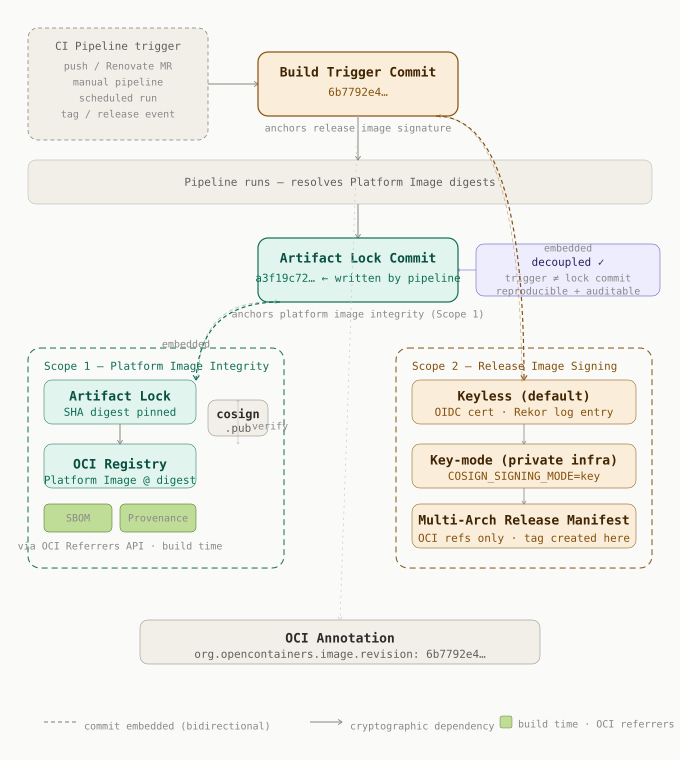
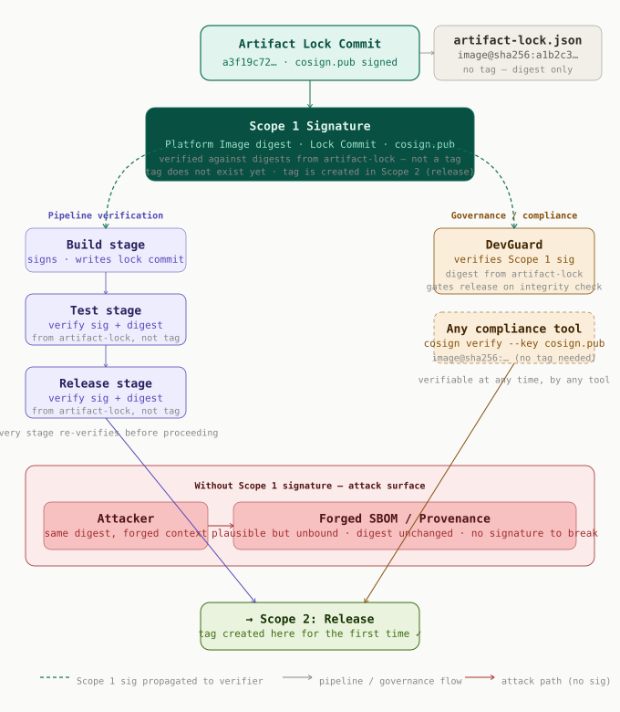
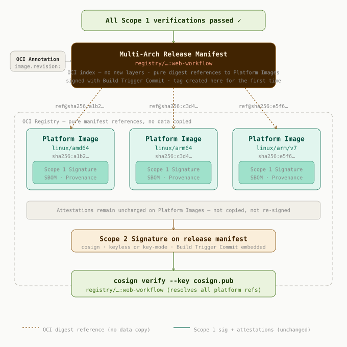

## 🔐 Supply Chain Security

This repository demonstrates end-to-end cryptographic supply chain security across two independent signing scopes, each anchored to a distinct Git commit.

overview of the two-commit architectur:



---

### Two commits, two cryptographic anchors

The architecture intentionally separates two concerns that are often conflated: **what triggered the build** and **which exact images were used**.

**Build Trigger Commit** (`6b7792e4…`)
The commit that caused the pipeline to run — a push, a Renovate MR, a manual trigger, or a scheduled release. This commit is embedded in the release image signature via the OCI annotation `org.opencontainers.image.revision`. It answers the question: *why was this image built?*

**Artifact Lock Commit** (`a3f19c72…`)
A commit written by the pipeline itself, after it has resolved the exact SHA digests of all Platform Images. It records the artifact lock files in the repository and becomes the cryptographic anchor for Scope 1. It answers the question: *what was this image built from?*

This decoupling is intentional: the two commits are independently verifiable and serve different audit purposes.

---

### Scope 1 — Platform Image Integrity



Platform Images are not referenced by mutable tags at build time. Instead, the pipeline resolves their exact SHA digests and pins them in cryptographically bound **artifact lock files**. The pipeline then writes an **Artifact Lock Commit** which becomes the anchor for Scope 1.

> **Important:** Scope 1 verification always uses the digest from the artifact lock file — never a tag. No tag exists at this point. The tag is created for the first time in Scope 2 during the release.

#### Continuous re-verification

The Scope 1 signature is not a one-time event. Every subsequent pipeline stage (Test, Release) is required to re-verify it before proceeding — using the digest from the artifact lock file, not a tag. External governance tools such as [DevGuard](https://devguard.io) perform the same verification and act as a release gate independently, without access to pipeline internals:

```bash
cosign verify \
  --key cosign.pub \
  --private-infrastructure \
  registry.hrz.uni-marburg.de/cibuilder/cibuild-demo@sha256:<digest>
```

#### Why the signature is non-negotiable

Without the Scope 1 signature, attestations (SBOM, Provenance) are unbound — they describe *a* build environment but are not cryptographically tied to *the* image that was actually produced. An attacker with write access to the registry or attestation store could push a different image and attach a plausible but forged SBOM and Provenance to it. The Scope 1 signature closes this gap: the digest, the lock commit, and `cosign.pub` form a triangle that cannot be forged without the private key.

---

### Scope 2 — Release Image Signing



The release stage runs only after all Scope 1 verifications have passed. It creates the multi-arch image tag **for the first time** and signs it with Cosign, embedding the Build Trigger Commit via the OCI annotation `org.opencontainers.image.revision`.

**The release image is not a new build artifact.** It is an OCI index manifest that references the already-signed Platform Images by digest — pure OCI links within the registry, no layers are copied or rebuilt. The Scope 1 signatures, SBOM, and Provenance attestations remain attached to the Platform Images unchanged. The release manifest inherits them through the OCI reference chain.

Two signing modes are supported:

**2a — Keyless (default)**
Signing is performed via a short-lived OIDC certificate issued by the Sigstore trust bundle. The Build Trigger Commit is recorded as a publicly auditable entry in the Rekor transparency log.

**2b — Key-mode (private infrastructure)**
For environments without public Rekor access, key-based signing is used instead (`CIBUILD_RELEASE_COSIGN_SIGNING_MODE=key`). The private key is provisioned via `CIBUILD_RELEASE_COSIGN_PRIVATE_KEY` (base64-encoded). The public key `cosign.pub` is committed to the repository.

In both modes, a CycloneDX SBOM and SLSA L2 provenance attestation are attached to the release manifest.

```bash
cosign verify \
  --key cosign.pub \
  --private-infrastructure \
  registry.hrz.uni-marburg.de/cibuilder/cibuild-demo:web-workflow
```
