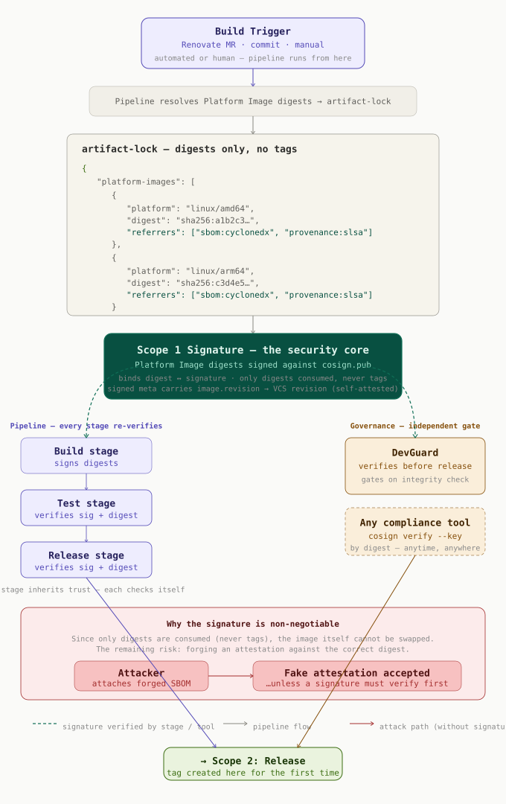

## 🔐 Supply Chain Security

This repository demonstrates end-to-end cryptographic supply chain security for container images, built on digest-addressed artifacts and Cosign signatures.

> **Infrastructure requirement:** The verification model relies on the OCI 1.1 Referrers API. It assumes an OCI 1.1-compliant registry with Referrers support (reference implementation: [Zot](https://zotregistry.dev)).

---

### Scope 1 — Platform Image Integrity



A build is triggered by a Renovate MR, a commit, or a manual run. The pipeline resolves the exact SHA digests of all Platform Images and pins them in an **artifact-lock** file. These digests — never tags — are what every subsequent step consumes.

**The security core is the signature over the digests.** The pinned Platform Image digests are signed against `cosign.pub`. This binds *digest ↔ signature*: the integrity guarantee rests on the signed digest set, not on any mutable reference.

#### Continuous re-verification

The signature is not a one-time event. Every pipeline stage (Test, Release) re-verifies it before proceeding, using the digest from the artifact-lock — no stage inherits trust from a previous one. External governance tools such as [DevGuard](https://devguard.io) perform the same verification independently and gate the release, without needing access to pipeline internals:

```bash
cosign verify \
  --key cosign.pub \
  --private-infrastructure \
  registry.hrz.uni-marburg.de/cibuilder/cibuild-demo@sha256:<digest>
```

Because verification is keyed only to the digest, it works at any time, from anywhere, with any `cosign verify`-capable tool.

#### Why the signature is non-negotiable

Since only digests are consumed and never tags, the Platform Image itself cannot be substituted. The remaining attack surface is forging an *attestation* (SBOM, Provenance) against the correct digest — a plausible but fabricated description of the build. Without a signature there is nothing whose failure would reveal the forgery; compliance tools that inspect attestations without verifying a signature would accept it. The signature closes this gap: the attestation is only trusted if it verifies against `cosign.pub`.

#### Note: VCS self-attestation

The signed metadata carries `org.opencontainers.image.revision`, binding the signature back to the originating VCS revision. This is a self-attested audit aid — the pipeline's own statement about the source state it built from — not an externally verified anchor. It is comparable to build provenance: an honest self-report, here at the pipeline/VCS level.

---

### Scope 2 — Release Image Signing


The release stage runs only after all Scope 1 verifications have passed. It creates the multi-arch image tag **for the first time** and signs it with Cosign.

**The release image is not a new build artifact.** It is an OCI index manifest that references the already-signed Platform Images by digest — pure OCI links within the registry, no layers are copied or rebuilt. The SBOM and Provenance attestations are attached to the Platform Images at build time via the OCI Referrers API (`CIBUILD_BUILD_SBOM=1`, `CIBUILD_BUILD_PROVENANCE=1`) and remain unchanged; they are not re-attached during the release.

Two signing modes are supported for the release manifest:

**Keyless (default)** — signing via a short-lived OIDC certificate from the Sigstore trust bundle, with the signature recorded in the public Rekor transparency log.

**Key-mode (private infrastructure)** — for environments without public Rekor access, key-based signing is used (`CIBUILD_RELEASE_COSIGN_SIGNING_MODE=key`). The private key is provisioned via `CIBUILD_RELEASE_COSIGN_PRIVATE_KEY` (base64-encoded); the public key `cosign.pub` is committed to the repository.

```bash
cosign verify \
  --key cosign.pub \
  --private-infrastructure \
  registry.hrz.uni-marburg.de/cibuilder/cibuild-demo:web-workflow
```
